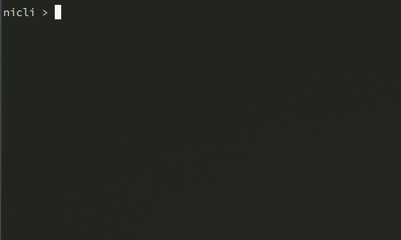

# ▶️ NICLI - Node Interactive (Redis-like) CLIs builder

<br>
<p align="center">
  
</p>
<br>

## Install

```bash
npm install niclijs
```

## Usage

Just put the prompt function in an endless loop and react to the returned input. Use **ctrl+c** as exit sequence.

```typescript
import { prompt } from "niclijs"

(async function () {
	while (true) {
		const input = await nicliPrompt(" NYCLY ▶️ ", [{ 
			command: "MYCOMMAND",
			description: "my command description"
		}], {
			promptColor: ["FgRed", "BgYellow"],
			inputColor: ["FgYellow"]
		})

		console.log(">>>", input)
	}
})()
```

### Special Keys

- **ctrl + c**: close the program
- **up/down arrows**: move through commands history
- **TAB**: autocomplete (if a command is suggested)

### Options

- **spaceAfterPrompt**: sets a space character between the prompt and the input (default: true)
- **suggestionColor**: sets the colors of the suggested commands
- **promptColor**: sets the color of the prompt
- **inputColor**: sets the color of the typed input

## Example

```typescript
import { prompt } from "niclijs"

const commands = 

(async function () {
	while (true) {
		const input = await nicliPrompt(" NYCLY ▶️ ", commands)

		console.log(">>>", input)
	}
})()
```